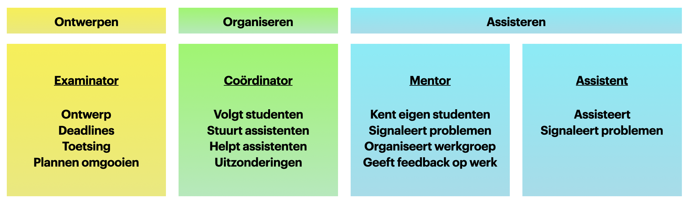
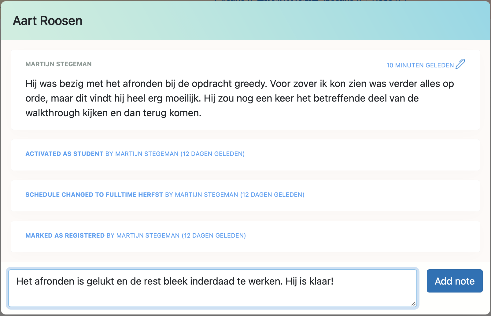
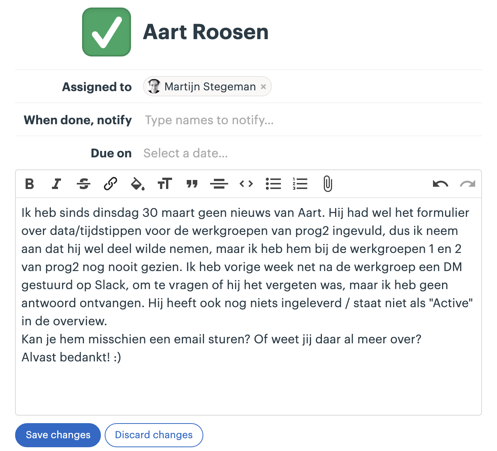
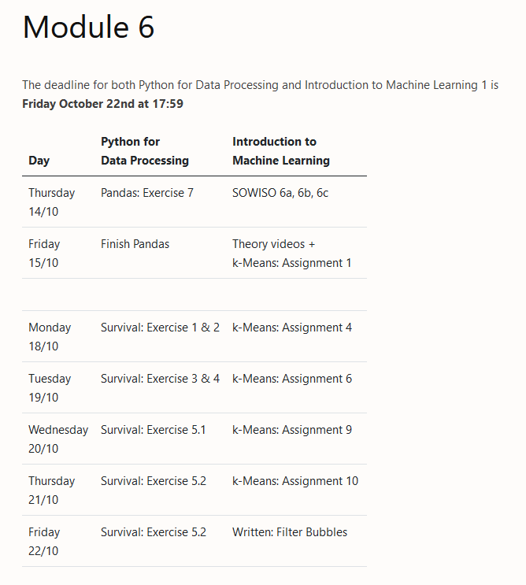
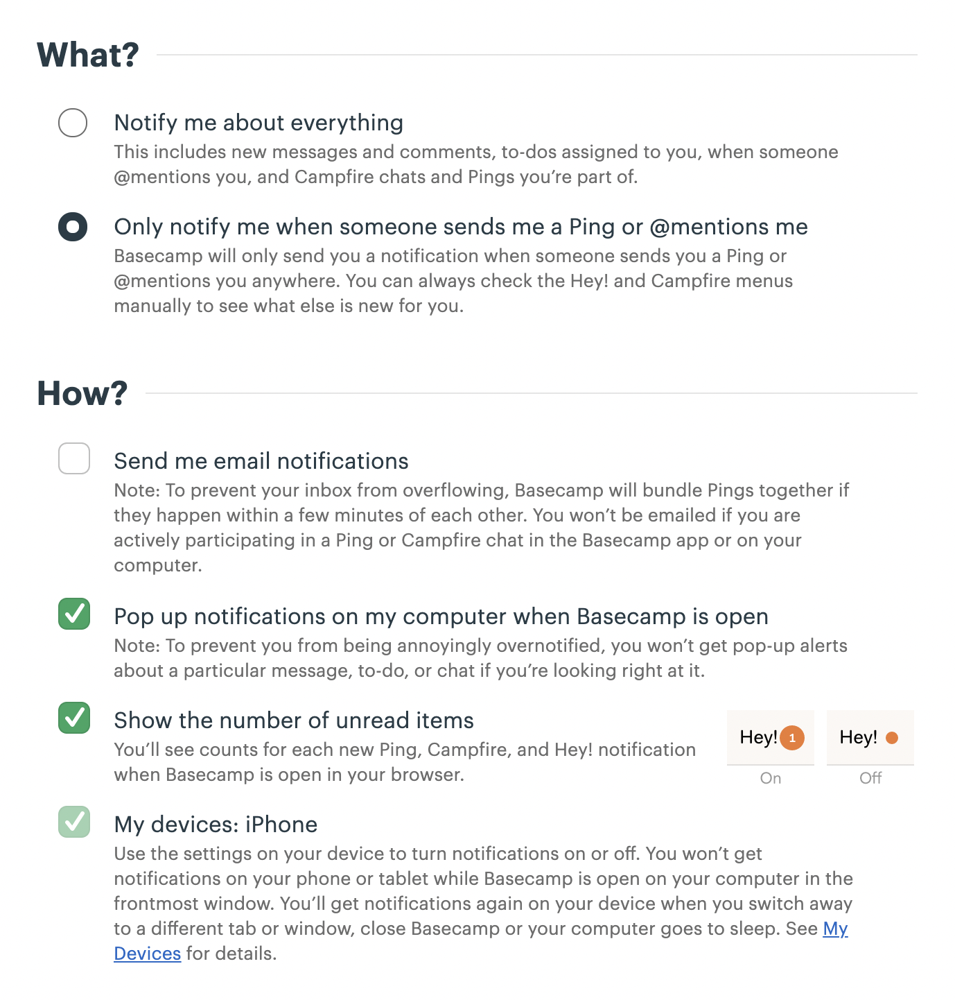

<header markdown="1">

# Assistentenhandboek Minor AI

## <small>Algemeen Herfst 2022</small>

<small>Deze versie is gemaakt in 2022 door Wouter Vrielink. Gebaseerd op het assistentenhandboek van de Minor Programmeren versie 2020 -- 2021 door Martijn Stegeman, versie 2016 door Hella Haanstra, en de instructies uit 2018 door Wouter Vrielink.</small>

</header>

Welkom bij de Minor AI! Dit studiejaar geven we les op locatie en assisteren we vanuit een vast lokaal.

Zoals altijd zijn er de studenten die geen idee hebben wat ze kunnen verwachten en binnen een paar weken veel verder zijn dan ze durfden te denken. Studenten die veel hulp nodig hebben maar stukje bij beetje er doorheen buffelen; allemaal zeer dankbaar voor de begeleiding en assistentie die we ze geven. En ja, dan zijn er nog de eigenwijzen die het allemaal eigenlijk al kunnen, en het beter weten. We gaan elkaar helpen om de moeilijke gevallen op de beste manier toch wat te leren.

Voor jou als assistent is deze handleiding met daarin allerlei praktische informatie en tips over hoe je je werk aanpakt. Zorg ervoor dat je de handleiding een paar keer gelezen hebt en kijk er vooral nog even naar als je voor het eerst gaat nakijken of een werkcollege gaat geven. Veel plezier en succes!

P.S. Wil je afwijken van de handleiding? Overleg dan even met je vakcoördinator.

💁 Tip: praat regelmatig met ervaren assistenten en de docenten! We vinden het allemaal leuk om te helpen, niet alleen studenten maar ook collega’s!

# 0 What's new

Voor assistenten die er vorig jaar bij waren, maar ook voor oud-studenten die nieuw komen assisteren.

Dit semester zijn er geen hoorcolleges. Een van de rollen van de hoorcolleges in eerdere versies van de minor was om aanvulling te geven aan de stof waar deze nog niet volledig was. In de voorbereiding voor dit semester is deze informatie verplaatst naar de opdrachten, filmpjes, en (ook nieuw!) werkcolleges. Om de studenten toch mogelijkheid te geven om vragen te stellen is er iedere woensdag een Q&A.

<!-- TODO:
- werkcolleges
- writtens beschrijving
-->

# 1 De Minor AI

De Minor AI is opgezet voor studenten die **geen** programmeerervaring en **geen** wiskundige achtergrond hebben. Het doel is om deze studenten een _veilige_ omgeving te bieden om te leren over programmeren, wiskunde, en AI. Hierbij doen ze ook ervaring op met technieken uit dataverwerking en software engineering.

Het programma is als volgt:

<table>
    <thead>
        <tr>
            <th>Blok 1</th>
            <th>Blok 2</th>
            <th>Blok 3</th>
        </tr>
    </thead>
    <tbody>
        <tr>
            <td>Python for Data Processing</td>
            <td>Data Processing and Representations</td>
            <td rowspan=2 style="vertical-align: middle;">Algoritmen en Heuristieken</td>
        </tr>
        <tr>
            <td>Introduction to Machine Learning 1</td>
            <td>Introduction to Machine Learning 2</td>
        </tr>
    </tbody>
</table>
 

Tijdens de eerste twee blokken van ieder 8 weken volgen de studenten dus twee vakken tegelijkertijd. Het derde blok is een projectvak, en duurt 4 weken. De vakken in de eerste twee weken bestaan allemaal uit 6 modules per stuk, waar de deadlines per module voor de vakken gelijk lopen.

Hieronder vind je een uitgebreid overzicht van de modules per vak.

- **Python for Data Processing** <http://pdp.mprog.nl>

  1. Introduction to Python; loops, lists, and plotting
  2. Introduction to Python; functions and random numbers
  3. Introduction to Python; dictionaries, more functions, and file I/O
  4. Monopoly
  5. Complexity
  6. Pandas + Survival
  {: start="1"}

- **Introduction to Machine Learning 1** <http://ml1.mprog.nl>

  1. Probability + Turings paper + Eliza
  2. Types of data + k-NN
  3. Probability distributions + Naive Bayes + Chinese room
  4. Gradients + Linear Regression + AlphaGo
  5. Linear Algebra + Polynomial Regression + Algorithmic Bias
  6. Exponentials and Logarithms + K-means + Filter Bubbles
  {: start="1"}

- **Data Processing and Representations** <http://dpr.mprog.nl>

  1. WIP
  2. WIP
  3. WIP
  4. WIP
  5. WIP
  6. WIP
  {: start="1"}

<!-- TODO Deze laat ik even, gaat nog veranderen -->

- **Introduction to Machine Learning 2** <http://ml2.mprog.nl

  1. Logistic Regression + Automation and Labour
  2. Neural Networks (Forward) + Model Release Strategies
  3. Neural Networks (Backward) + Automated Decision Making in Society
  4. Decision Trees and Random Forests + Interpretable AI
  5. Convolutional Neural Networks + Software 2.0
  6. Deep Learning + Understanding AI Systems
  {: start="1"}

<!-- TODO Aanpassen naar nieuwe writtens? -->

- **Algoritmen en Heuristieken**

  Gegeven is een “onoplosbaar” probleem, waarvoor met behulp van klassieke AI-technieken toch nog redelijke oplossingen berekend kunnen worden. De problemen, “cases”, komen uit allerlei vakgebieden en zijn vaak zeer realistische benaderingen van problemen uit de echte wereld. Dit vak heeft geen modules.

<!-- Alle vakken kunnen naar keuze in fulltime of parttime gevolgd worden. Studenten maken deze keuze al bij de aanmelding. Alleen het Machine Learning Project wordt uitsluitend in de 4-weekse periodes in januari en juni (blok 3 en 6) aangeboden en is dus voor alle studenten fulltime. -->

# 2 Contact

Er zijn vier manieren waarop studenten actief betrokken worden bij de cursus: werkcolleges, practica, checkups en assistentie. Deze worden hier kort besproken. Over al deze onderwerpen staat uitleg voor de studenten in de syllabus op de websites.

## 2.1 Werkcolleges

Werkcolleges vinden wekelijks plaats en worden georganiseerd door mentoren (zie volgende hoofdstuk). In de werkcolleges krijgen studenten de kans om samen de voortgang te bespreken, de oefeningen door te nemen, tips uit te wisselen over het aanpakken van problemen, en medestudenten en mentor beter te leren kennen. Mentoren krijgen inhoud voor de werkcolleges aangereikt via de <wcai.mprog.nl> website. Lees die voor ieder werkcollege goed door!

Voor ieder werkcollege staat twee uur ingeroosterd. Vaak zullen de geplande onderdelen niet de volle twee uur opnemen. Wanneer er tijd over is besteed je deze tijd, *in het lokaal waarin het werkcollege geroosterd is*, aan het helpen van je studenten. Zie dit als een soort extra persoonlijke assistentie-uren. Dit is ook *het* moment waarop je feedback op de opdrachten kan bespreken met je studenten; dat kan klassikaal, of individueel.

> Bereid je voor op elk werkcollege door even snel naar de ingeleverde opgaves te kijken. Vaak kan je aan het ingeleverde werk van de studenten al zien wat ze moeilijk vinden. Hier kan je tijdens de wekelijkse terugblik dan aan refereren, of gerichte vragen over stellen.

## 2.2 Practica

Voor studenten is een werkplek gereserveerd gedurende de practicumuren. Bij Fulltime is er in principe voor elke student de hele week een plek in ons lokaal. Het is allereerst een plek voor studenten om bij elkaar te komen, elkaar te helpen, en samen aan de opdrachten te werken.

<!-- Voor Parttime zijn er geen vaste werkplekken. -->

## 2.3 Morning meetings (alleen Fulltime)

Fulltimestudenten doen elke dag voordat de assistentie begint een meeting met hun mentorgroep, zonder de mentor. De bedoeling is om kort te reviewen hoe iedereen ervoor staat met de opdrachten en wat de plannen voor vandaag zijn. Dit is ook het moment waarop studenten weer even met elkaar kunnen afspreken, bijvoorbeeld om elkaar te helpen, of om samen een vraag te stellen tijdens de assistentie. Deze meetings zijn niet verplicht voor de studenten, maar aanwezigheid is aan te raden!

## 2.4 Assistentie

Elke student zou regelmatig hulp nodig moeten hebben tijdens het programmeren (maar niet teveel). Hiervoor kunnen studenten vragen stellen via Hands.

# 3 Taakverdeling

Bij de uitvoering van de cursus zijn de verantwoordelijkheden verdeeld over de verschillende medewerkers. Als assistent heb je allereerst de verantwoordelijkheid om een aantal uur per week studenten uit de hele groep te **assisteren** met hun programmeeropdrachten. Daarnaast ben je voor een vaste groep studenten de **mentor**. Als mentor ben je het eerste aanspreekpunt voor de studenten in jouw groep. Het is daarom belangrijk dat je als mentor precies weet hoe de cursus in elkaar steekt en welke regels van toepassing zijn, voor zover die in de studiewijzer vermeld staan. Je leert de studenten uit je groep goed kennen en houdt nauwkeurig hun voortgang bij. Dit is bovendien de groep studenten van wie je het werk nakijkt.

De **coördinator** van een cursus werkt met de mentoren om de voortgang van alle studenten bij te houden. De coördinatie kan gedelegeerd zijn aan één of meer docenten of ervaren assistenten. De coördinator heeft toegang tot de resultaten en inzendingen van alle groepen, en kan zo de verschillen goed zien en makkelijk de lastigere gevallen vinden. Voor inlichtingen over studenten zal altijd de mentor worden geraadpleegd. De coördinator is ook degene die assistenten helpt om goed hun werk te kunnen doen en heeft wekelijks contact met ze. Zo wordt het nakijkwerk altijd even nagelopen voordat de coördinator dit publiceert, en zo nodig worden assistenten om aanpassingen gevraagd. Tot slot verzorgt de coördinator de wekelijkse plagiaatcheck en eventuele gesprekken met studenten hierover.

De **examinator** heeft het totaaloverzicht over hoe de cursus in elkaar zit en heeft de verantwoordelijkheid om te zorgen dat elke student de cursus goed kan doorlopen en daarvoor uiteindelijk een passend cijfer ontvangt. Ook kan de examinator studenten helpen die niet goed meekomen en tussentijds hun plannen willen omgooien. De examinator dient bovendien als contactpersoon voor studieadviseurs en examencommissie.

# 4 Informatievergaring

Het contact dat we met studenten hebben is een belangrijke bron van informatie over hun persoonlijke voortgang en welzijn, op basis waarvan we hulp kunnen bieden. Maar we horen van studenten natuurlijk ook of de cursus goed werkt voor ze en duidelijk is. Assistenten _moeten_ daarom deze informatie delen met de andere assistenten en docenten. Of het nu feiten zijn of vermoedens, dat maakt niet uit. Alles om de cursus beter te maken en studenten beter te helpen.

⚠️ Het is een essentieel onderdeel van je werk dat je deze signaleringsfunctie vervult.

Informatie delen we binnen het team via twee systemen: enerzijds de website van de cursus, zoals <https://ml1.mprog.nl/>, en anderzijds de tool voor interne communicatie genaamd [Basecamp](https://www.basecamp.com/). Verderop in de handleiding vind je hier en daar meer informatie over beide systemen.

- **Verslaglegging over individuele studenten** doe je via de <u>website</u> van de cursus. Het doel is om later terug te kunnen lezen hoe het gaat.
    - Omstandigheden van de student uitleggen (mentor).
    - Ziekmelding van een student (docent).
    - Verslag na assisteren: waar zat de student (echt) mee, hoe heb je geholpen, zijn er nog losse eindjes.

⚠️ Let op dat deze notities op de website alleen worden gelezen wanneer er gezocht wordt naar extra informatie over een student. Urgente problemen moeten altijd los gemeld worden!

- **Urgente problemen van individuele studenten** meld je via een Todo op <u>Basecamp</u> en wordt overgenomen door de coördinator.
    - Student is onbereikbaar.
    - Student houdt zich niet aan een speciale afspraak.
    - Student mist de normale deadline.

- **Verslaglegging of vragen over de cursus**, ofwel zaken die op meerdere studenten betrekking hebben of zelfs de hele groep doe je via een Message op <u>Basecamp</u> zodat iedereen kan meedenken.
    - Melding van problemen van diverse studenten bij een opdracht.
    - Het nut van een opdracht ter discussie stellen.
    - Vraag naar de bedoeling van een onderdeel.

- **Vastlopers in de cursus**, ofwel dingen waar "iedereen" in de problemen komt en snel opgelost moeten worden meld je ook via een Message op <u>Basecamp</u>.
    - Opdracht staat niet open.
    - Download werkt niet.
    - Er zijn geen instructies doorgestuurd naar iedereen.

Op de volgende pagina voorbeelden van verslaglegging en probleemmelding over een enkele student.

Verslaglegging in de cursuswebsite:

{: style="max-width:60%; margin: 0 auto; "}

Verzoek om actie in Basecamp:
{: style="margin-top:3rem"}

{: style="max-width:60%; margin: 0 auto; "}

# 5 Mentoren

Mentoren krijgen een groep van 10 -- 17 studenten (afhankelijk van de snelheid van de cursus) voor wie zij het eerste aanspreekpunt zijn. Hieronder een uitwerking van de verschillende verantwoordelijkheden.

## 5.1 Aanspreekpunt

Als mentor leer je alle studenten uit je mentorgroep goed kennen. Dat betekent dat je na een paar weken het volgende weet over je studenten:

- Eigen hoofdopleiding
- Programmeerervaring
- Comfort met programmeren, naar eigen gevoel
- Kan voldoende/altijd aanwezig zijn
- Werkt graag samen of niet
- Levert tijdig in
- Neemt goed deel aan de cursus en de werkcolleges

Het kan handig zijn om dit ergens voor jezelf te noteren, op de website bijvoorbeeld. Hoewel je als mentor de belangrijke details over je studenten kent, beperkt het contact met je studenten zich wel tot zaken die van belang zijn voor het onderwijs.

Dat je je studenten goed kent maakt je ook het juiste aanspreekpunt voor de cursus. Dat betekent dat studenten zich al gauw bij jou zullen melden als ze een organisatorische vraag hebben waarvoor ze het antwoord niet kunnen vinden. Maar ook bij persoonlijke problemen zullen ze ongetwijfeld naar jou toe komen.

⚠️ Doe geen beloftes aan studenten over het verloop de cursus of regelingen anders dan wat er al letterlijk in de studiewijzer staat. Studenten zullen zeer vaak tussen neus en lippen door even "naar de bekende weg vragen". Maar als het niet in de studiewijzer staat dan nemen de docenten beslissingen op individuele basis. Ga dus niet in op dit soort vragen en verwijs naar de juiste kanalen.

## 5.2 Doorverwijzen

Jij hoeft je als assistent niet bezig te houden met:

- plagiaat
- ziekmeldingen
- serieuze studieproblemen
- problemen op persoonlijk vlak

Komt een van deze dingen naar voren, verwijs dit altijd door naar de cursuscoördinator. Vraag de student **allereerst** om zelf een mail te sturen naar <minorai@mprog.nl>. Maar studenten vinden het vaak moeilijk om verdere hulp te vragen, dus de mentor moet het ook direct melden (via een Todo in Basecamp). Het is belangrijk dat wij vanaf de eerste vraag om hulp medeverantwoordelijkheid nemen en een student niet aan het lot overlaten. De examinator kan wanneer nodig de mentor vervolgens inlichten over afspraken die gemaakt zijn.

Bij meer persoonlijke problemen proberen we altijd goed gebruik te maken van de faciliteiten van de universiteit, zoals studieadviseurs en studentendecanen. De examinator weet meer over de mogelijkheden en kan studenten verwijzen. De mentor hoeft dat niet zelf te doen, maar is vaak wel de eerste die de problemen signaleert.

Als we verwijzen naar de studieadviseur zorgen we altijd dat de student een duidelijke en concrete hulpvraag heeft. De studieadviseur is namelijk geen wondermiddel. Blijkt een student bijvoorbeeld heel weinig tijd te hebben, dan moeten we de student wellicht vragen om een moeilijke keuze te maken en te overwegen een vak te laten vallen. De studieadviseur kan vervolgens helpen bij het maken van de juiste keuze.

## 5.3 Signaleren

Mentoren zijn bij uitstek het aanspreekpunt voor klachten en voor grote frustraties die studenten opbouwen tijdens het programmeren. Dit kan naar boven komen tijdens de werkcolleges (en we vragen er ook actief naar). Dat is geen probleem! Zie het niet als een persoonlijke aanval, maar als een noodzakelijke uitlaatklep. Ga er vooral niet in mee, en ga ook zeker niet in de verdediging. Het belangrijkste is dat studenten het kunnen uiten. Wanneer er aanpassingen nodig zijn aan het vak (nu, of misschien volgend semester) kan je een message of Todo op Basecamp maken.

## 5.4 Groepsvorming

De belangrijkste elementen voor groepsvorming zitten in de structuur van de werkcolleges: studenten worden geacht samen te werken voor bepaalde opdrachten en binnen het werkcollege vinden discussies plaats over de schrijfopdrachten. Als mentor kun je bovendien bijdragen door te zorgen dat elke student tijdens het werkcollege aan het woord komt en zich zo een klein beetje presenteert aan de rest (sommige studenten vermijden dit een beetje!). Schroom vooral niet om studenten met soortgelijke problemen, of studenten die er wat sneller doorheen gaan aan elkaar te koppelen.

## 5.5 werkcolleges organiseren

De werkcolleges zijn een plek om kennis te maken met je studenten, maar vooral om de studenten te helpen elkaar te leren kennen.

- Het werkcollege is de plek waar de **feedback** en **opdrachten** belangrijk worden gemaakt. Jij zorgt dat studenten van elkaars feedback kunnen leren door een aantal belangrijke patronen aan te stippen. En je bespreekt enkele van de gedane opdrachten (die al zijn ingeleverd).
- In het werkcollege wordt ook aandacht besteed aan het **oefenen** van belangrijke concepten uit design en style, maar ook het gebruik van de terminal komt bijvoorbeeld voorbij. Dit gebeurt aan de hand van kleine opdrachten met bijbehorende theorie en vragen hierover. Jij zorgt er voor dat ieder van de studenten deze oefening bewust maakt, en stelt kritische vragen waar nodig. Probeer studenten te enthousiasmeren voor deze onderwerpen, en geef waar nodig extra voorbeelden.
- In de eerste weken zal er veel vraag zijn vanuit de studenten over design en style. Dit is normaal, aangezien dit een van de hoofdonderdelen van hun cijfer zal zijn, terwijl ze er nog niet veel over weten. Om de studenten hier iets in tegemoet te komen zullen we de eerste twee modules design en style niet beoordelen en daarnaast **code reviews** gaan doen waarbij studenten elkaars code beoordelen.
- Daarnaast zal er (vaak) ruimte zijn voor **discussie** over de schrijfopdrachten. Hierin is je rol die discussie te begeleiden en af te kappen waar er te ver van het hoofdonderwerp afgeweken wordt. Zorg ervoor dat iedereen aan het woord komt, en dat het een _veilige_ omgeving blijft voor
- De rest van het werkcollege kan je besteden aan **extra persoonlijke aandacht** voor de studenten. Zie het als een soort "open" assistentietijd waar je ze een extra zetje in de rug kunt geven wanneer dat nodig is.

Op wcai.mprog.nl vind je een uitgebreidere instructie en een tijdsindicatie voor alle onderdelen per werkcollege.

## 5.6 Communicatietools

Omdat we nog niet zeker weten dat onze studenten altijd 100% aanwezig kunnen zijn, gebruiken de mentoren **Slack** om hun studenten te informeren, om ziekmeldingen te ontvangen en om ze met elkaar te kunnen laten communiceren buiten de groep om. Deze Slack wordt door de mentor zelf aangemaakt (hierover later in dit document meer informatie).

Maar: mentoren zullen *niet* veel beschikbaar zijn via Slack. Dit wordt in de studiewijzer verteld en jij gaat dit als mentor zelf ook bij het eerste werkcollege duidelijk maken. Coördinatoren zijn zelfs helemaal niet in de Slack te vinden.

Ga als mentor ook niet in een Whatsapp zitten die studenten aanmaken. Geef duidelijk aan dat ze jou alleen via Slack kunnen bereiken en tijdens het werkcollege, en de docenten alleen via e-mail of tijdens een spreekuur. Zo zorg je er zelf voor dat je niet continu bezig hoeft te zijn met je mentorrol.

⚠️ In verband met de normale privacyregels moet je de contactgegevens en zelf-aangemaakte Slack verwijderen na afloop van de cursus.

⚠️ Stuur geen mails naar je studenten via Datanose, omdat hierin niet altijd de goede mailadressen staan. Gebruik Slack voor afstemming met je studenten.

# 6 Assisteren

Elke student zou regelmatig hulp nodig moeten hebben tijdens het programmeren (maar niet teveel). 🆕 Deze assistentie wordt volledig op locatie georganiseerd in ons lokaal. Studenten kunnen een hulpvraag indienen via de website. Hierbij geven ze hun locatie aan, de opdracht waar ze mee bezig zijn, en beschrijven ze het probleem dat ze hebben. Deze hands verschijnen voor de assistenten op de website en kunnen zo overzichtelijk behandeld worden. Zodra je bij een student geweest bent en de vraag beantwoord hebt, teken je de hands af.

⚠️ Roostering voor het assisteren wordt pas kort voor de start van het vak gedaan omdat veel assistenten pas laat horen in welke werkcolleges zij zelf geroosterd zijn.

## 6.1 Regel één van assisteren is...

Het doel van assisteren is om studenten **verder te helpen** tijdens het leren. Dat betekent dat we altijd afwegingen moeten maken hoe we iemand helpen; een afweging gebaseerd op hoe de student ervoor staat, of de vraag goed gesteld is, of er nog genoeg tijd is tot de deadline.

Maar de belangrijkste regel is: **we geven het antwoord niet weg**. Dat antwoord kan verschillen: het kan een ontbrekende stap in het ontwerp zijn, het kan een regel code zijn of iets dat verkeerd staat. In plaats van studenten rechtstreeks vertellen wat ze moeten doen, moeten we ze helpen nadenken over wat hun volgende stap is. Welke aanwijzingen hebben ze om verder te komen?

> Maar het varieert wel! Blijkt de vraag in feite over het ontwerp van de oplossing te gaan, dan moet je iemand misschien helpen om een paar stappen terug te doen en de opdracht goed te lezen. Maar gaat de vraag over een technisch probleem, dan kun je ze misschien wat directer wijzen hoe ze hun probleem kunnen oplossen, bijvoorbeeld door een concrete foutmelding in Google te plakken. Tot slot kan het zijn dat je ziet dat een heel klein deeltje van de oplossing verkeerd is gekozen/gelezen, of dat ze iets hebben gedaan dat helemaal niet in de cursus zit. Als dat moeilijk te vinden gaat zijn, dan moet je er misschien toch op wijzen.

Hou deze regel altijd in gedachten en maak een **bewuste keuze**. Je mag het ook best zeggen tegen studenten: "ik moet even nadenken hoe ik je het beste kan helpen zonder het antwoord weg te geven". Maar wel vriendelijk! Als je de oplossing niet weet, mag je dat ook zeggen. Je kunt altijd een ervaren assistent of docent een vraag stellen of erbij roepen!

⚠️ Een consequentie van deze regel is dat we proberen bij het assisteren nooit het toetsenbord van de student aanraken. Heb er vertrouwen in dat je student kán leren en dat het zelf doen de beste manier is om dit te bereiken. Ook je student moet dit vertrouwen krijgen. Is het echt noodzakelijk om even iets voor te doen? Pak dan bij voorkeur je eigen computer erbij. Zorg dat je student het daarna meteen zelf toepast in de eigen code.

## 6.2 Ken je opdrachten

Kijk de opdrachten en bijbehorende theorie of filmpjes altijd van te voren nog even door, zodat je goed voor de dag komt. Gebruik eventuele overgebleven tijd om opdrachten te lezen die je nog niet kent.

## 6.3 Soorten vragen

Tijdens het assisteren helpen we studenten op vijf gebieden:

1. probleemdecompositie
2. implementatie
3. procesondersteuning
4. vragen formuleren
5. debugging

Dat betekent dus dat het méér is dan alleen duidelijk gestelde vragen beantwoorden. Nog sterker, bijna geen enkele vraag tijdens het assisteren zal helemaal duidelijk geformuleerd zijn. Dat is ook waarom wij echt wat toe te voegen hebben!

Hieronder vind je de belangrijkste situaties en problemen en manieren om daar mee om te gaan.

### Situatie: code is onleesbaar.

Is de stijl van de code totaal niet op orde? Vraag de student dan altijd eerst om deze netjes te maken. Niet alleen omdat het "hoort" maar omdat verkeerde stijl het probleem heel moeilijk vindbaar kan maken. Met een beetje mazzel is het daarna zo gevonden (studenten in deze fase hebben overigens vaak ook nog een probleem met de analyse van hun probleem, dus kijk daar ook naar). In principe blijf je bij de student zodat je eventueel kan inspringen 🙃, maar als het echt lang duurt kan je altijd terugkomen.

### Probleem: Wat is de opdracht?

Waarschijnlijk zijn er, zeker in het begin van de cursus, veel vragen die eigenlijk gaan over wat er in de **opdracht** bedoeld wordt. Het is niet altijd makkelijk om een goed overzicht te krijgen van de opdracht.  Tijdens het helpen is het nuttig om te vragen of de student wilt uitleggen of ze willen opzoeken wat het onderdeel is van de opgave waar ze nu aan werken, en dit dan nog even een keer samen door te lopen. Geef de student hier de leiding in.

In veel gevallen is het probleem van een student terug te leiden naar de analyse die een student heeft gedaan van het algoritme waar we naar op zoek zijn. Is er een verkeerde **aanname** gedaan, of is een formule toch niet helemaal **correct**, dan is het vaak nodig om extra voorbeelden (cases) te bedenken en uit te vogelen waar het verkeerd zit. Zorg dat je in dit geval de student vraagt om dat te doen en later nog eens terug te komen als het nodig is.

Vaak zal je merken dat een student **helemaal geen goede analyse** heeft gedaan. Help je student dan een deelprobleem te kiezen en dit te analyseren met hulp van enkele slim gekozen voorbeelden (geef zelf een voorbeeld en laat je student er ook eentje bijdragen).

### Probleem: Het overzicht kwijtgeraakt

Soms heeft je student echt geen **overzicht** meer ("ik weet niet waar ik moet beginnen"). Dan is het handig om de student naar het algoritmische deel van de opdracht te sturen, en later pas invoer/uitvoer goed te maken. Dit is een manier om het probleem kleiner te maken.

> _Hoe kun je beginnen bij het algoritmische deel? Bij Greedy moet de gebruikersinvoer bijvoorbeeld een float zijn, die vervolgens wordt omgezet naar een `int` vóórdat het algoritme ermee aan de slag gaat. Dat is van zichzelf al best moeilijk en is een groot deel van de opdracht. Maar dan moet het wisselgeld nog berekend worden. Oplossing: dat user input-deel vervangen door een `input = 42` waarin je het getal kunt aanpassen om te testen. Het geeft beginners vaak veel lucht als ze zo simpel kunnen beginnen met het moeilijkste deel._

Soms is het vooral **integratie** waar een student hulp bij nodig heeft. Er is een aardig uitgewerkt algoritme, maar het overzicht ontbreekt nog. Hoe koppel je de invoer aan het algoritme en hoe zorg je dat het programma het juiste resultaat uitvoert? Dat kan nog best lastig zijn. Dit is onderdeel van de implementatie. Ook hier is het nuttig om de decompositie uit te bespreken en uit te vogelen waar het probleem zit.

⚠️ Laat je student wel <u>zelf</u> het betreffende deel van de opdracht opzoeken op de website: dingen waarvan je verwacht dat studenten ze zelf doen laat je ze ook bij het assisteren zelf doen.

### Situatie: Geen concrete vraag.

Er is altijd een kans dat een student nog geen concrete vraag heeft. Help de student in dat geval de vraag formuleren zoals hierboven uitgelegd. Sommige studenten kunnen ook nog wat meer tijd gebruiken om zelf wat langer naar hun programma te kijken voordat je ze echt gaat helpen; probeer zelf een juiste inschatting van de situatie te maken om vervolgens te besluiten de student direct te helpen, of een duwtje in de goede richting te geven en later nog even terug te laten komen.

### Probleem: Een heuse bug

En natuurlijk zijn er veel situaties waarin er een echte **bug** in het programma zit. Het programma zelf heeft al min of meer de juiste vorm, maar er worden bijvoorbeeld variabelen hergebruikt waardoor het niet goed loopt. Dat is het moment dat je hardop gaat meedenken over debug-technieken. Het is aan assistenten om de student deze vaardigheden aan te leren. Natuurlijk kijk je eerst of de student eigenlijk wel weet hoe het debuggen moet (misschien eerst maar eens checken of alle variabelen de juiste waarde hebben met behulp van `print()`?).

Kijk voor een opfrisser in *Think Python*[^3], hoofdstuk 20: Debugging.

## 6.4 Algemene gesprekstechnieken[^1]

Begrijp dat veel studenten niet gewend zijn om een probleem op te lossen waar meer dan één antwoord voor is. Het proces om dit te leren kan zeer frustrerend voor ze zijn. Neem dus hun frustraties gewoon aan en probeer ze naar een concrete vraag te leiden. 'Waar ben je met de opdracht? Wat heb je al gedaan?'

Geef duidelijke verbale signalen af tijdens het assisteren, met name in de fase waarin jij vragen begint te stellen aan de student om het probleem beter te begrijpen of kennis te checken.

- Kies voor 'heel goed antwoord!', 'zeker weten' of 'precies', etc. Probeer een droog 'ok', 'hmm', 'uhu' te vermijden. Ook als de student een langdradig antwoord geeft, kun je het relevante deel nog een keer samenvatten en herhalen, en daarbij expliciet maken dat dat het goede deel van het antwoord is. Zo help je de gedachten stroomlijnen.

- Probeer expliciete verbanden te leggen als die niet door je student genoemd worden. Als deze bijvoorbeeld een for-loop voorstelt bij `mario.py`, antwoord iets in de trant van: 'heel goed, je ziet dat er een vorm van herhaling nodig is'.

- Probeer voort te bouwen op het antwoord van de student. Als het antwoord dat de student geeft niet helemaal naar wens is, probeer het dan mee te nemen in je volgende vraag. Iets als 'je hebt goed gezien dat je de string moet opdelen, wat is de volgende stap?' werkt motiverend.

- Probeer 'ja, maar...' te vermijden. Dit is een logische reactie op een (deels) fout antwoord, maar kan heel erg demotiverend werken. Probeer duidelijk te scheiden wat goed was en wat fout was en benoem dat neutraal. Je kunt ook de vraag stellen 'hoe ben je daarop gekomen?'; overigens ook als een opmerking van een student wél goed is!

Doe tot slot geen aannames over wat studenten al weten. Een student kan soms met zelfs het makkelijkste probleem in de knel zitten en dan is het erg frustrerend als er wordt gezegd 'probeer eens wat harder na te denken'. Toets wat de student wel weet en bouw daarop voort. Stel open vragen en laat de student zelf het probleem oplossen, probeer niets voor te zeggen!

<!-- TODO hieronder nog een stukje over hands en gedrag tijdens assisteren -->

## 6.5 Het Hands-systeem

voorbeeldscreenshots Hands
- Hoe ziet het er uit voor student (hands_vraag.png + hands_waiting.png + hands_no_wait.png + hands_not_too_much.png)
- Hoe ziet het er uit voor assistent (hands_menu.png)
- Tijden aangeven (hands_times.png)
- Vragenlijst op volgorde afwerken (hands_overzicht.png + hands_voor_accept.png + hands_accepted.png)
- Vragen terugzetten voor jezelf (hands_terug_gezet.png)
- Vragen terugzetten voor iemand anders (hands_terug_gezet_ander.png)
- Vragen voltooien (hands_geen_studenten.png)

<!-- ## 7.5 Werkwijze programmeerbalie

Vanaf dit jaar komen studenten altijd naar de programmeerbalie in A1.24 als ze hulp nodig hebben (tenzij we gedeeltelijk op afstand werken).

### Afspraak maken

Studenten kunnen een hulpvraag indienen via de website. Ze hebben deze keuze uit een beperkt aantal opties: sommige zijn "zo snel mogelijk," hopelijk binnen 2 uur. Andere opties zijn juist morgen. Het is niet mogelijk om ver vooraf een afspraak te maken.

### Ontvangst

Op de afgesproken tijd komen studenten naar lokaal A1.24. De docent of assistent die "greeter" is zal ze daar ontvangen en zonodig even in de wacht houden. Deze persoon kan kleinere problemen ook zelf afhandelen, maar alléén als dat niet teveel afleidt van het organiseren van de korte wachtrij.

### Assisteren

Zodra het kan wordt een student naar één van de assistenten gestuurd. Als assistent zoek je meteen even de gegevens van deze student op, in de juiste cursuswebsite. Vraag dus naar naam en cursus. Op de site vind je notities die bij het eerdere assisteren zijn achtergelaten. Misschien heeft de vorige assistent wel expliciet gevraagd aan de student om iets te doen. Dubbelcheck dat!

**Situatie: geen concrete vraag.** Juist bij de balie is er een kans dat een student nog geen concrete vraag heeft. Help de student in dat geval de vraag formuleren zoals hierboven uitgelegd (6.3). Sommige studenten kunnen ook nog wat meer tijd gebruiken om zelf wat langer naar hun programma te kijken voordat je ze echt gaat helpen; probeer zelf een juiste inschatting van de situatie te maken om vervolgens te besluiten de student direct te helpen, of een duwtje in de goede richting te geven en later nog even terug te laten komen.

**Situatie: code is onleesbaar.** Is de indentatie totaal niet op orde? Vraag de student dan altijd eerst om deze netjes te maken. Niet alleen omdat het "hoort" maar omdat verkeerde indentatie het probleem heel moeilijk vindbaar kan maken. Met een beetje mazzel is het daarna zo gevonden (studenten in deze fase hebben overigens vaak ook nog een probleem met de analyse van hun probleem, dus kijk daar ook naar). In principe blijft de student bij jou zodat je eventueel kan inspringen 🙃, maar als het echt lang duurt laat je de student straks terugkomen.

### Tijdsbesteding

- Probeer zo'n 10 minuten per student aan te houden. Een absoluut maximum is 20 minuten, in noodgevallen. Duurt het langer, haal dan de greeter erbij om te zorgen dat de planning niet in de soep loopt.

- Als je een student later wil laten terugkomen, meld dit dan ook bij de greeter. Vertel bovendien duidelijk tegen de student wat je verwachting is en hoe deze zich weer kan melden.

- Kom je er zelf niet uit? Dan kun je natuurlijk altijd even vragen of één van je mede-assistenten of de greeter mee kan kijken. Het is expliciet de bedoeling dat onervaren assistenten zonodig hulp inschakelen en zich zo verder ontwikkelen.

### Verslag

Na het helpen schrijf je op de website een korte samenvatting van het uiteindelijke probleem en hoe je geholpen hebt. Noteer het ook als je de student hebt gevraagd iets te doen en later terug te komen. De volgende assistent kan deze informatie ook lezen en daar op inspelen. -->

# 7 Deadlines en ziekmelding

Bij onze cursussen gebruiken we zowel deadlines als een dagschema om te zorgen dat studenten de cursus op tijd af krijgen en wij regelmatig ons nakijkwerk kunnen doen.

## 7.1 Dagschema

Voor alle studenten geldt dat de verwachting is dat ze het tempo van het dagschema bijhouden. Hier een voorbeeld van een dagschema:

{: style="max-width:40%; margin: 0 auto; display: block;"}

Bij fulltime is het belangrijk dat ze dit schema echt dagelijks volgen. Als een student hier meer dan een dag vanaf wijkt is het belangrijk dat dit gemeld wordt.

<!-- Bij fulltime moeten ze dat schema ook echt dagelijks volgen, bij parttime kunnen ze natuurlijk binnen de week iets schuiven, bijvoorbeeld in verband met deadlines van een ander vak. -->

## 7.2 Deadlines

Naast het dagschema zijn er ook gewoon deadlines. Deze staan aangegeven bij de dagschema's.

De **implementatie** of uitwerking van alle opdrachten moet steeds aan het eind van het schema zijn ingeleverd. De opdrachten moeten dan af zijn, en `checkpy` moet de uitwerking hebben goedgekeurd waar mogelijk.

Het doel van de deadlines is om te zorgen dat er ook duidelijkheid is in het geval studenten het schema net niet bijhouden. Ze moeten dan binnen de week nog inhalen om de deadline te kunnen halen.

## 7.3 Ziekmelding

Bij ziekte loopt de planning al gauw in de soep. Als een student meerdere dagen niet aan de opdrachten kan werken, dan ligt het voor de hand dat het niet vóór het weekend af is. Daarom willen wij dat studenten zich ziekmelden. Die melding gaat via minorai@mprog.nl.

Wanneer je toch zelf zo'n melding krijgt dan ga je zo te werk:

- Je wenst je student beterschap
- Je vraagt de student een mail te sturen naar minorai@mprog.nl
- Je maakt een TODO aan op Basecamp, die afgevinkt kan worden door de coördinator zodra de mail van de student daadwerkelijk is ontvangen

<!-- - Je wenst je student beterschap en vraagt meteen om even te laten weten als ze weer aan de slag gaan.
- Je voert deze melding in op de website bij de student. -->

## 7.4 Te-laatmelding

🆕 Als de planning dan niet gehaald wordt en de deadline dreigt te worden overschreden, dan verwachten wij ook weer een melding van de studenten. Het maakt daarbij niet uit of het een grote opdracht of een kleine oefening is, studenten moeten actief hun achterstand melden.

Als je zo'n melding krijgt dan ga je zo te werk:

- Je neemt deze melding gewoon aan als feit.
- Je voert een opmerking in via de website.
- Na het weekend controleer je of je student inmiddels alles af heeft.
- Als het niet gelukt is maak je een Todo op Basecamp voor je coördinator.

In dat laatste geval krijgt de coördinator dus de verantwoordelijkheid om het contact over te nemen en te kijken of deze student nog op de rails te krijgen is.

Als je de vraag krijgt of het nog zin heeft om een opdracht te maken is het antwoord altijd "ja", want om het vak te halen moeten alle opdrachten gedaan zijn. Tegelijk meld je dat ze dit echt met de docent moeten bespreken. Ze gaan dus z.s.m. naar het spreekuur.

⚠️ Zoals je hierboven kunt afleiden geef jij als mentor in feite geen uitzonderingen of uitstel. In plaats daarvan zorg je voor goede communicatie en doorverwijzing.

## 7.5 Studenten die niks melden

Het kan ook zijn dat een student een keer niks inlevert en ook niks meldt. Daarom is het belangrijk dat je vlak na de deadline even in je overzicht kijkt of er nog iets ontbreekt. Neem dan **proactief** contact op met je studenten om te zorgen dat dit snel gecorrigeerd wordt -- en ga er in eerste instantie vanuit dat het een foutje is. Is er meer aan de hand dan maak je een Todo op Basecamp.

(╯°□°）╯ﾐ ┻━┻
{: style="text-align: center; padding:10rem 0;"}

# 8 Nakijken

De eindcijfers van de studenten zijn van een aantal verschillende cijfers afhankelijk. De onderdelen die worden nagekeken door de assistenten worden beoordeelt op een schaal van 0 tot en met 4. Wanneer er voldoende gemaakt is van de opgave wordt er 6 bij deze score opgeteld, voor een uiteindelijk cijfer van 6 tot en met 10. Wanneer een student stukken van de opgave niet maakt, of wel érg weinig moeite doet voor een opgave, kan er in overleg met de coördinator een cijfer gegeven worden onder de 6. In de studiewijzer van ieder van de vakken staan alle componenten van het eindcijfer opgesomd.

## 8.1 Nakijkdeadline

De nakijkdeadline is afhankelijk van de deadlines voor studenten. Tenzij anders afgesproken is de nakijkdeadline 3 werkdagen na de deadline van de studenten. Zodra jij klaar bent wordt het nakijkwerk nog nagelopen door de coördinator, jij doet op verzoek eventuele aanpassingen, en vervolgens wordt alles gepubliceerd. Het doel is altijd om alle feedback en het cijfer gepubliceerd te hebben voor de volgende deadline van de studenten.

## 8.2 Feedback

Voor elke student schrijf je feedback naar aanleiding van het ingeleverde werk. Je inhoudelijke feedback is redelijk kort, to the point en bevat goede suggesties voor acties om te ondernemen. De feedback bevat geen spelfouten en is geschreven in (korte) volzinnen. Het is erg belangrijk om de feedback niet als verantwoording van het cijfer te zien. De feedback hoeft dus niet 100% compleet te zijn, je kunt meer details altijd beter even in persoon bespreken. Heb je hulp nodig bij het formuleren van prettige feedback? Bespreek het met je coördinator!

Bekijk eens deze feedback waarin vijf feedbackpunten zijn verwerkt. Dit is een voorbeeld van feedback zoals we die graag zien.

> **greedy**
>
> - De uitwerking is erg netjes! De comments zijn veel begrijpelijker zo. ⓵
> - Probeer volgende keer de variabelenamen zoals `amt` volledig uit te schrijven. ⓶
> - Comments zijn to the point, heel goed. ⓷
>
> **mario**
>
> - Erg veel functies! Zo wordt het programma, dat
> in feite heel eenvoudig is, erg ingewikkeld om te lezen. Kijk volgende
> keer of je de gulden middenweg kunt vinden. ⓸
> - Verder mooi gedaan, net als bij greedy. ⓹
{: style="background-color: #eee; padding: 0.5rem 1rem; margin-left: 0"}

Hieronder vind je een aantal aanwijzingen over het schrijven van feedback. Op enkele plekken verwijzen we weer naar de feedbackpunten uit het voorbeeld.

### Toon

Vergeet niet ook positieve feedback te geven! Feedback wordt veel prettiger verwerkt als ook de positieve punten worden aangestipt. De makkelijkste manier om dit te doen is om vóór het nakijken even de uitlegpagina's design en style door te nemen en daar niet alleen negatieve maar ook positieve voorbeelden uit te halen. Zie als voorbeeld de eerste zin van ⓵, en ook ⓷ en ⓹. En ondanks deze grote hoeveelheid positieve opmerkingen staan er toch ook twee zeer concrete verbeterpunten in de feedback.

Daarnaast moet je een scherp oog ontwikkelen voor de goede intenties van studenten. Er zijn maar weinig studenten die expres geen aandacht besteden aan het schrijven van nette code. Veel vaker zijn studenten helemaal overladen met informatie en het gewoon vergeten. Of ze waren zo blij dat het eindelijk werkte... En er zijn studenten die gewoon helemaal los gaan met een nieuwe techniek en de balans uit het oog verliezen. Zie bij ⓸ hoe de feedback niet te negatief probeert te zijn, maar wel duidelijk een probleem signaleert.

En dan nog een paar concrete dingen om te vermijden:

- Stel geen (retorische) vragen in de feedback. Deze kunnen zonder uitzondering met een naar toontje gelezen worden, zelfs als je het goed bedoelt. Dat is zonde. Veel retorische vragen beginnen met "Waarom...".

- Gebruik om dezelfde reden nooit woorden zoals "jammer", "helaas", "slecht". Je bent er om studenten te helpen, niet om ze terecht te wijzen.

- Vermijd het woord "echter" en andere overmatig formele woorden.

### Inhoud

Inhoudelijk maak je de feedback zo concreet mogelijk door problemen te benoemen, tips te geven en de leesbaarheid en begrijpelijkheid code te analyseren.

- Probeer bij de feedback het niveau van de individuele student mee te nemen. Vergelijk de student met zichzelf: in hoeverre heeft de student de feedback van voorgaande weken toegepast en is de kwaliteit vooruitgegaan? Zie ⓵. Dit zou van zichzelf weinig tot geen invloed moeten hebben op het cijfer maar is goed om te benoemen. Dit laat ook zien dat je aandacht hebt voor individuen, niet alleen voor de hele groep.

- Geef altijd feedback op het product, of het proces, maar niet op de student zelf. Dit is ook al kort aangestipt bij gesprekstechnieken voor assisteren. Directe feedback op de persoon is veel minder effectief dan feedback op het proces[^5] omdat dit vaak zeer negatief geïnterpreteerd wordt. Geef daarom in de feedback goed aan waarom iets goed of minder goed is (zie ⓸, en ook het gebruik van "de uitwerking" bij ⓵).

- Bied simpele tips aan, zodat de student de volgende keer de knelpunten beter kan aanpakken. Zie ⓶ en ⓸. Deze kunnen soms wat "obvious" overkomen maar dat geeft wel houvast.

- Probeer niet té specifiek te zijn. Regelnummers en gekopieerde stukken code zijn vaak niet nodig. Je kunt de feedback altijd nog gedetailleerd bespreken met de student tijdens het eerstvolgende werkcollege.

### Opmaak

De feedback moet lichtjes opgemaakt worden met behulp van Markdown. Hier een voorbeeld van hoe het zou moeten:

      **greedy**⏎
      ⏎
      - De uitwerking is erg netjes! De comments zijn veel begrijpelijker zo. ⏎
      - Probeer volgende keer de variabelenamen zoals `amt` volledig uit te schrijven.⏎
      - Comments zijn to the point, heel goed.⏎
      ⏎
      **mario**⏎
      ⏎
      - Erg veel functies! Zo wordt het programma, dat⏎
        in feite heel eenvoudig is, erg ingewikkeld om te lezen. Kijk volgende⏎
        keer of je de gulden middenweg kunt vinden.⏎
      - Verdere mooi gedaan, net als bij greedy.⏎

Bovenstaande zal omgezet worden naar HTML en netjes leesbaar zijn voor studenten. Let op dat er geen Markdown-kopjes gebruikt worden (deze worden veel te groot) en dat er witregels boven de lijstjes staan. Als je geen witregels neerzet komen alle punten achter elkaar te staan.

## 8.3 Becijfering
{:.break}

<!-- TODO Zetten we dit hier of alleen in syllabus? -->

<!-- Alle modules kunnen 1--6 punten opleveren. Voor elke module zijn diverse aspecten aangegeven op basis waarvan de punten voornamelijk (maar niet uitsluitend) worden bepaald. De aspecten gaan over codekwaliteit, en specifiek over **leesbaarheid** en **begrijpelijkheid**. De schaal is als volgt:

6. uitzonderlijk goede kwaliteit op basis van een doordacht ontwerp
5. zeer goede kwaliteit, beperkt ruimte voor verbetering
4. degelijke kwaliteit op de genoemde aspecten, met ruimte voor verbetering
3. net voldoende aandacht voor de genoemde aspecten, erg veel ruimte voor verbetering
2. enige zichtbare aandacht voor een beperkt aantal aspecten
1. onvoldoende zichtbare aandacht voor de kwaliteitsaspecten
{: start="6" reversed=""}

In deze schaal zitten een aantal patronen verborgen die het---met enige ervaring---makkelijker moeten maken om een inzending te beoordelen. Het is moeilijk om deze patronen tijdens de cursus al helemaal aan de studenten over te brengen, maar zorg dat jij ze helemaal begrijpt en toepast.

- 1--4 punten gaat specifiek over de *genoemde* aspecten, dus de aspecten die deze week expliciet aan de opdracht gekoppeld zijn. Bij 4 punten is de student redelijkerwijs waar we iedereen willen hebben. Onze aandacht bij het nakijken gaat dus vooral naar deze studenten uit! Zij moeten snel beter worden.

- Bij 3 punten zie je dat iemand wel de aspecten heeft "afgewerkt" maar niet heel consequent. Er is dus wel bewijs dat de student het kán, maar deze doet het niet overal. Het wordt 4 punten als de aspecten wel grotendeels consequent ("degelijk") zijn toegepast.

- Bij 3--4 punten (en hoger) wordt gevraagd dat naar álle aspecten is gekeken. Het is dus niet zo dat studenten de aspecten onderling kunnen compenseren! Zijn er hele goede namen maar staat er geen commentaar, dan is het meteen 2 punten.

- 5--6 punten gaat over goede kwaliteit, zonder de aspecten te noemen. Studenten die hoog willen scoren moeten dus namelijk zelf aan de bak met uitzoeken hoe je goede code schrijft---alleen de regels volgen voldoet dan niet meer. Dit is om te voorkomen dat eigenwijze studenten hacker-achtige code schrijven en hoge cijfers opeisen omdat het formeel aan de aspecten voldoet.

- 6 punten heeft het ook over *ontwerp*, waarvoor duidelijk moet blijken dat een student een heel eigen idee voor de code heeft bedacht en dit mooi leesbaar heeft uitgewerkt; maar pas op, iets als "extra functies gebruiken" kan heel mooi worden, maar dan moeten ze goed gekozen zijn en de namen ook goed zijn, dus veel ideeën zijn niet zomaar goed!

Het is absoluut niet de bedoeling dat studenten **meerdere keren** minder dan 3 punten halen. Daarom heeft tijdige feedback de hoogste prioriteit, en specifiek feedback die de student helpt volgende keer direct 3 of 4 punten te halen. We nemen hier als docenten en assistenten dus medeverantwoordelijkheid!

Als de opdrachten **niet af** zijn (volgens `check50`), dan kan er in feite nog niet nagekeken worden en zal er uiteindelijk ook geen eindcijfer komen. We gebruiken eventueel het invoeren van 0 punten om dit te signaleren, maar de mentor zou op dat moment, samen met de coördinator, al actie moeten hebben ondernomen (student achterna zitten en hulp bieden). -->

## 8.4 Algemeen

Het is handig om na het nakijken nog even terug te gaan naar de eerste paar inzendingen die je hebt nagekeken, omdat je vaak in de loop van het nakijken op andere dingen gaat letten. Het is daarnaast handig om steeds dezelfde opdracht in een rijtje na te kijken. Kijk wel steeds in een andere volgorde na, omdat je meestal de laatste iets strenger beoordeelt.

In het begin zal het nakijken wat moeizaam gaan, maar probeer maximaal 10--15 minuten per student te spenderen. Nadat je wat ervaring hebt opgebouwd zal je zien dat het nakijken sneller gaat (vraag anders om hulp!). Probeer in je geschreven feedback niet in herhaling te vallen, maar verwijs kort naar je eerdere feedback. Daarbij telt ook mee dat sommige van de studenten de feedback nauwelijks lezen terwijl andere studenten juist veel uit je commentaar halen. Pas je feedback dus ook aan op basis van wat studenten ermee doen en de vragen die je er over krijgt.

Dat gezegd hebbende, als je merkt dat een student de feedback negeert, spreek hem of haar hier dan even persoonlijk op aan (bijvoorbeeld een kort gesprekje na het werkcollege). Grote kans dat ze het vergeten zijn of niet doorhebben hoe veel ze eraan kunnen hebben.

Tot slot: je schrijft uiteindelijk op je eigen manier. Daarom is het zinvol om tijdens de werkcolleges af en toe expliciet jouw manier van feedback geven wat meer toe te lichten. Dan kun je ook noemen dat studenten altijd mogen vragen als ze iets niet begrijpen of niet weten hoe ze het beter kunnen maken.

## 8.5 Plagiaat

Het is helemaal prima als studenten elkaar helpen. Het allerbelangrijkste is dat de student die geholpen wordt nooit voorbeeldcode te zien krijgt of zodanig wordt geïnstrueerd dat de code gedeeltelijk door een ander bedacht is.

Het kan gebeuren dat tijdens het nakijken blijkt dat een opdracht verdacht veel op de opdracht van een andere student lijkt, of oplossingen bevat die ook op het internet te vinden zijn. Indien je serieus plagiaat vermoedt, meld dit dan _altijd_ bij de coördinator. Ter aanvulling wordt na elke inleverronde een plagiaatcheck gedaan.

Scoort iemand hoog wat betreft plagiaat dan neemt de coördinator contact op met deze student. Het gesprek bestaat uit voorlichting en een aanbod om te helpen met de beste aanpak om het vak te halen. Van belang is dat studenten zich niet teveel zorgen maken hierover. Aantoonbaar plagiaat moet natuurlijk naar de examencommissie, maar ons doel is vooral om te zorgen dat studenten de cursus alsnog zelfstandig halen.

> **Vragen** over plagiaat moeten studenten zelf stellen aan de coördinator, via <minorai@mprog.nl>. Een persoonlijk gesprek is altijd mogelijk.

# 9 Interne communicatie

Voor bijna al het contact tussen docenten en assistenten is er [Basecamp](https://www.basecamp.com/). De verwachting is dat je zeker niet altijd, maar wel regelmatig kijkt wat er te doen is.

- Zorg dat je tijdens het je ingeroosterde assistentie-uren eventuele Basecamp-berichten direct ontvangt met een notification.
- Zorg dat je regelmatig Basecamp-berichten naleest, zeker rondom (nakijk-)deadlines. Dit zodat onduidelijke situaties snel verhelderd kunnen worden.

Je kunt Basecamp als volgt configureren, zodat je alleen notifications krijgt als het bericht specifiek voor jou bedoeld is.

{: style="max-width:50%; margin: 0 auto; display: block;"}

Als je geen notifications op je mobiel wil hebben, zorg dan dat je wél "Send me e-mail notifications" aan zet. Het mag namelijk niet zo zijn dat je dagenlang niet bereikbaar bent via Basecamp: dit is echt de enige tool voor onze communicatie.

Als je teveel irrelevante notifications krijgt, dan kun je de notifications voor een project uitzetten. In het "Programming Lab"-kanaal worden nooit berichten over de vakken zelf gepost, dus die zou je gerust kunnen unfollowen:

{: style="max-width:50%; margin: 0 auto; display: block;"}

En je kunt je zelfs per bericht nog uitschrijven voor notifications.

## 9.1 Tools

Belangrijkste is dat je Basecamp niet gebruikt alsof het Whatsapp is: je stuurt bijna nooit een persoonlijk bericht naar een collega. De reden is dat bijna elke vraag of opmerking relevant of leerzaam kan zijn voor je mede-assistenten.

- Heb je dus een vraag, wil je iets ter discussie stellen, heb je een mooi voorstel: schrijf een **Message** in één van de Basecamp-projecten.
- Heb je informatie over een student, een concreet verzoek om iets gedaan te krijgen, dan moet iemand anders iets voor jou doen. Schroom dan niet en maak direct een **Todo** aan.
- Heb je zelf persoonlijke problemen die je liever niet aan de grote klok hangt? **Ping** dan je coördinator of Martijn en spreek even af. Maar "domme" vragen toch graag via een Message naar iedereen hoor!
- Heb je een urgent en concreet probleem, bijvoorbeeld tijdens het assisteren, dan kan iedereen je potentieel helpen en schrijf je dus een bericht in de **Campfire** van jouw cursus. Weet je wie aan het werk is? Doe dan ook een @mention.
- Heb je gewoon zin om wat te delen met de rest van het team (bijvoorbeeld een meme) dan kun je dat ook doen in de **Campfire** van jouw cursus.

Met name het aanmaken van **Todo**'s voor iemand anders is misschien even wennen. Maar het is helemaal OK! We hebben nu eenmaal elk onze eigen verantwoordelijkheden. Maak dus geen Todo aan zonder deze te assignen, meestal aan je coördinator. Het is juist de manier om te zorgen dat studenten niet vergeten worden maar tegelijk iedereen de dingen op een zelfgekozen moment kan afhandelen. En zit er een deadline aan, stel deze dan ook gerust in!

Berichten over **specifieke studenten** plaats je ook als Todo in het project van jouw vak. Het is belangrijk dat we deze informatie delen met het team. Andere assistenten en docenten gaan hier natuurlijk discreet mee om, en kunnen bovendien aanvullen met hun eigen kennis over de student. Eventuele details over ziektes en omstandigheden e.d. kun je weglaten als dat een beter idee is.

Het kan zijn dat je post wordt verplaatst als je deze beter op een andere plek had kunnen plaatsen (kwestie van oefenen!).

# 10 Checklist opstarten

Je moet diverse accounts aanmaken om goed te kunnen assisteren. Volg de stappen hieronder en zorg vooral dat je alle diensten goed **uittest**, om latere stress te voorkomen!

- Voor **Basecamp** krijg je een uitnodiging via het bekende e-mailadres (je kunt dit dus niet zelf starten). Maak via die uitnodiging direct dit account aan.

- Maak een account voor **Python for Data Processing** via <https://pdp.mprog.nl/> en **Introduction to Machine Learning 1** via <https://ml1.mprog.nl/>. Kies fulltime of parttime afhankelijk van waar je assisteert. Na enige tijd krijg je extra rechten, zodat je de gegevens van je studenten kunt inzien en hun werk kunt nakijken.

- Lees de **studiewijzer** op de websites van de eerste vakken heel nauwkeurig door zodat je deze niet tegenspreekt. Mis je iets in de studiewijzer of heb je een vraag? Post dan meteen een vraag in Basecamp.

- Maak zelf een nieuwe **Slack** aan via <https://slack.com/get-started#/create>. Deze gebruik je voor informeel contact met je mentorgroep. Ken je Slack nog niet? Kijk dan bij [Slack 101](https://slack.com/intl/en-nl/resources/slack-101/set-up-slack) voor de basis. Zorg in verband met privacy dat de groep alleen voor hen is en dat deze weer wordt verwijderd zodra je geen mentor van deze groep meer bent.

# Eindnoten

[^1]: A. Hadwin and S. Wilcox, "A handbook for teaching assistants," Instructional Development Centre Queens University, Kingston, Ontario, K7L 3N6, 1999--2000.
[^2]: D. J. Malan, [cs50.harvard.edu](https://cs50.harvard.edu/), 2007--2021.
[^3]: A. B. Downey, Think Python. O'Reilly Media, 2012.
[^5]: J. Hattie and H. Timperley, "The power of feedback," Review of Educational Research, vol. 77, no. 1, pp. 81--112, 2007.
[^6]: https://basecamp.com/handbook/10-how-we-work
