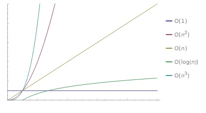

## Complexity

### Introductie

De efficiëntie van de code kunnen we bepalen door $\mathcal{O}$. Big-$\mathcal{O}$ (Engels, zeg "big oh") beschrijft hoe snel de *running time*, ofwel het gemaakte aantal 'stappen' in de code, groeit relatief aan de grootte van de *input* van de code. De grootte van de input wordt aangegeven met de letter $n$. Big $\mathcal{O}$ geeft ons een indicatie van de langst mogelijke running time van een algoritme.

De big $\m athcal{O}$ van een algoritme is gedefinieerd als een bovengrens aan de hoeveelheid stappen die het algoritme zal doorlopen. Voor het bepalen van de big $\mathcal{O}$ van een algoritme is het dus noodzakelijk om de input te vinden die ervoor zorgt dat het algoritme zo veel mogelijk stappen doorloopt. Deze input wordt ook wel de "worst case" genoemd. Bij het zoeken van een element in een lijst bijvoorbeeld, is de best case dat het element vooraan in de lijst staat; één stap. De worst case voor dit scenario is dat het element helemaal niet voorkomt in de lijst, dan moeten we namelijk de hele lijst doorlopen. De hoeveelheid stappen is in dit geval gelijk aan de lengte van de lijst: `n`. De big $\mathcal{O}$ van het vinden van een element in een ongesorteerde lijst is dan ook $\mathcal{O}(n)$.

We kunnen de big $\mathcal{O}$ van een algoritme bepalen door uit een analyse van code alleen de grootste term te pakken, en alle andere termen te negeren. Als een algoritme twee keer over zijn input loopt van lengte $n$, en daarna door middel van een geneste loop ieder element in de input met ieder ander element vergelijkt is de complexiteit dus niet $2n + n^2$. De grootste term hieruit is $n^2$, dus we versimpelen we dit naar $\mathcal{O}(n^2)$. We doen dit omdat het voor heel grote waardes voor $n$ eigenlijk altijd zo is dat alles behalve de grootste term verwaarloosbaar wordt. Neem $100n$ en $n^2$ bijvoorbeeld. Vanaf $n=100$ is $100n$ altijd sneller dan $n^2$, en op $n=1000000$ is het verschil zo gigantisch dat de vermenigvuldiging met $100$ verwaarloosbaar is geworden.

Een makkelijke manier van het bepalen van de complexiteit is door per regel van de code te bepalen hoe vaak deze uitgevoerd wordt. Dit kan je doen in termen van $n$. Is er een for-loop die $n$ keer loopt? Dan wordt de code daarbinnen $n$ keer uitgevoerd. Let extra op bij regels met het keyword `in`. De complexiteit van deze regels is afhankelijk van het type datastructuur waarop `in` wordt uitgevoerd. Bij lijsten (iterable) is dit $\mathcal{O}(n)$, want we moeten ieder element af te gaan om te kijken of dit het element is wat we zoeken. Terwijl bij dictionaries/sets (hashable) dit $\mathcal{O}(1)$ is, want we kunnen direct de index van het element ophalen door het element te hashen.

Voor onze studenten is belangrijk:

- Constante tijd, big $\mathcal{O}(1)$. Dit betekent dat onafhankelijk van de grootte van de input het programma altijd evenveel stappen doorloopt.
- Lineaire tijd, big $\mathcal{O}(n)$, waar $n$ het aantal elementen in de input voorstelt. Dit betekent dat als de input met 1 element groeit, er een vaste hoeveelheid stappen bij komt. **Let op** dat het dus ook zo kan zijn dat er per element 1000 stappen bij komen!
- Kwadratische tijd, big $\mathcal{O}(n^2)$. Dit betekent dat als de input met 1 element groeit, het aantal stappen met $n$ toeneemt.

Daarnaast zijn er nog wat andere complexiteiten zoals exponentieel, lineairitmisch, logaritmisch, etc., maar die zijn voor nu minder belangrijk. Je zou de verschillen tussen de complexiteiten kunnen verduidelijken voor de studenten door een grafiek als hieronder te tekenen.

### Antwoorden + uitleg

Doorloop samen met de studenten de vragen één voor één. Hierbij laat je de studenten zo veel mogelijk aan het woord. Laat zo veel mogelijk de studenten aan het woord. Als je merkt dat de studenten nog niet echt actief meedoen kan je er een paar voordoen. Vraag daarna aan de studenten om de volgende te doen.

⚠️ Je vraagt hier niet alleen om het antwoord: de student moet het antwoord ook kunnen verantwoorden. Wanneer dit niet lukt, kan je een voorbeeld van een uitleg geven, en het voor de volgende vraag weer proberen. Shortcuts zoals "for-loop, dus O(n)", werken niet altijd en daar moet je dus over doorvragen. De for-loop moet namelijk wel afhankelijk zijn van de lengte van de input.

#### Part 1

Q1: $\mathcal{O}(n)$
Er is een linear verband tussen de grootte van $n$ en de stappen in de code. Er is één for-loop, waarvan de inhoud altijd exact `n` keer herhaald wordt. De inhoud van de loop blijft constant en is niet afhankelijk van de grootte van de input. Er zijn geen andere operaties die afhankelijk zijn van de grootte van de input.

Q2: $\mathcal{O}(1)$
De complexiteit is onafhankelijk van de input. Hoe groot `n` ook wordt, de code voert een constante hoeveelheid (10) 'stappen' uit. De inhoud van de loop blijft constant en is niet afhankelijk van de grootte van de input.

Q3: $\mathcal{O}(n^2)$
Er is hier sprake van een kwadratische relatie tussen de lengte van de input en de complexiteit. De inhoud van de buitenste for-loop wordt `n` keer uitgevoerd. Hieronder valt ook de binnenste for-loop die zelf ook nog eens zijn inhoud `n` keer uitgevoerd wordt. In totaal wordt de binnenkant dus `n^2` keer uitgevoerd.

Q4: $\mathcal{O}(n)$
Er is een linear verband tussen de grootte van `n` en de stappen in de code. De inhoud van de loop wordt altijd `3*n` keer herhaald; het aantal stappen stijgt bij vergroting van `n` een vaste hoeveelheid (3 per toename van 1 op `n`). Na versimpeling verdwijnt de `3`. (zie ook de uitleg hierboven)

#### Part 2

Q5: $\mathcal{O}(n^2)$
Het gaat hier om een implementatie van **Bubble Sort**. In het geval van de minst gesorteerde lijst (voor bubble sort is dit de lijst die verkeerdom gesorteerd is) moeten we de while loop $n - 1$ keer herhalen. De for loop daarbinnen draait $n$ keer. $(n - 1) * n$ versimpelen we naar $n^2$.

Q6: $\mathcal{O}(1)$
Doordat Pythons `set()` de elementen indexeert met een hash, is `in` een Big $\mathcal{O}(1)$ (constante) operatie.

Q7: $\mathcal{O}(n)$
Net als in Q6 is hier sprake van een constante opzoektijd binnen de set. Echter loopen we wel over het aantal items in de set, en moet er dus $n$ keer iets herhaald worden.

Q8: $\mathcal{O}(n)$
In de eerste regels worden er twee sets gemaakt van lengte `n`.
Het `&`-teken tussen twee sets berekent de intersection tussen de twee sets. Dit zijn de elementen die zowel in set A als in set B voorkomen. Dit kan gedaan worden door voor ieder item in de kortste set te kijken of het ook in de andere set voorkomt:

    intersection = set()
    for item in set_A:
        if item in set_B:
            intersection.add(item)

We loopen over één van de sets met een lengte van `n`, en gebruiken `in` om te zoeken in de andere set. Dit zoeken is `in` een Big $\mathcal{O}(1)$ (constante) operatie, dus is de complexiteit lineair.

Q9: $\mathcal{O}(n^2)$
In de eerste regels worden er twee lijsten gemaakt van lengte `n`.
Er is hier eigenlijk sprake van een dubbele for-loop: als met `in` lijst wordt doorgezocht moet ieder element bekeken worden. Wanneer het element wat we zoeken achteraan in de lijst staat, moeten allebei de lijsten compleet worden doorlopen.

Q10: $\mathcal{O}(n^2)$
In de eerste regels wordt er een dictionary gemaakt met `n` keys, met als value een lijst van lengte `n`.
De regels hieronder zijn in complexiteit exact hetzelfde als bij Q9. Er wordt geloopt over `n` elementen en er wordt gekeken of een element voorkomt in een lijst van lengte `n`.
